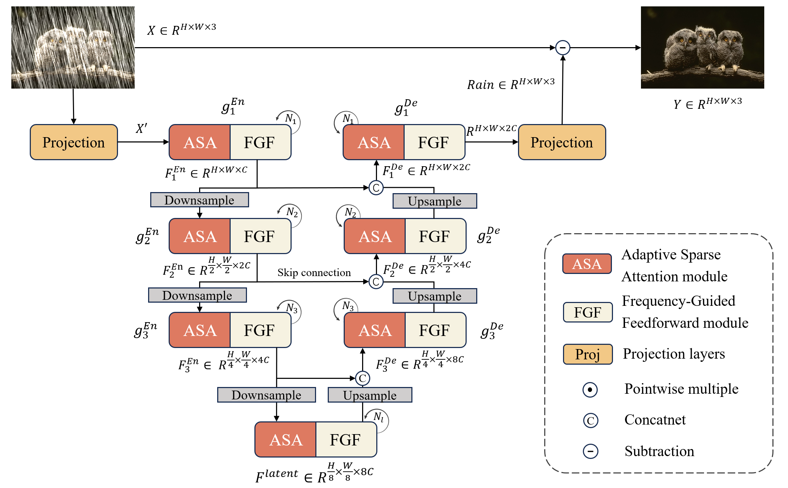
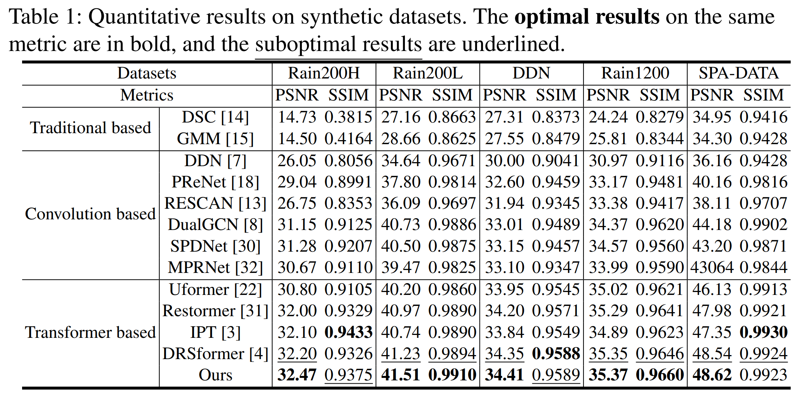
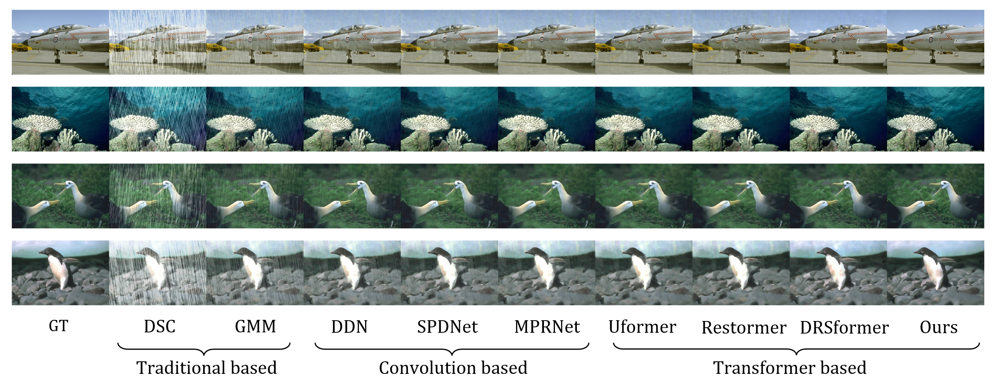
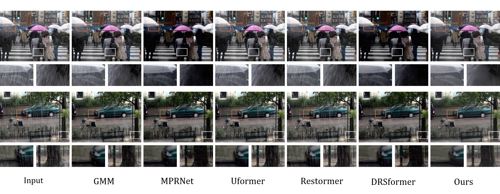

# SFformer: Adaptive Sparse and Frequency-Guided Transformer Network for Single Image Derain

## Introduction
```
Recently transformer models have become prominent models for single image deraining (SID) task. owever, these models often fail to utilize frequency knowledge and appropriate self-attention mechanisms effectively, leading to inadequate extraction of rain features and persistent artifacts. To alleviate this problem, we propose Adaptive Sparse and Frequency-Guided Transformer Network (SFformer) for single image derain. Specifically, we propose Adaptive Sparse Attention (ASA) module to selectively pay attention to the most useful channels for better feature aggregation.  In addition, considering that rain streaks mainly correspond to the high frequency components in the image, we introduce Frequency-Guided Feedforward (FGF) module to focus on rain streaks. Integrating these proposed modules into a UNet backbone, extensive experimental results on commonly used benchmarks show that the proposed method outperforms current state-of-the-art method.
```
Following is the whole structure of our proposed SFformer.


## Installation

### Clone this repo:
```bash
git clone https://github.com/AnonymousUserForConference/SFformer.git
```

### Prepare the environment:
```bash
pip install -r requirements.txt
```
Try to install the packages manually if you run requirements.txt and encounter errors.
 Some packages may need to be installed with anaconda, switch pip/conda when you encounter errors.
 We find that the version of most packages is not strict (except pytorch), so you can try to install the latest version of the package.
 This project run best under pytorch 1.x, while the local-rank/local_rank problem may occur in pytorch 2.x, blocking runing the code. 

### Setup
```bash
export NCCL_P2P_DISABLE=1
python setup.py develop --no_cuda_ext
```

### Prepare datasets
* Rain200H/Rain200L

Please refer to [homepage](http://www.icst.pku.edu.cn/struct/Projects/joint_rain_removal.html) for the Rain100H/Rain100L on the website. Note that we call it as Rain200H/Rain200L to distinguish it from the their old version.
* Rain1200(DID)

Please refer to [their code repository](https://github.com/hezhangsprinter/DID-MDN) for the DID dataset.
* DDN(Rain1400)

Please refer to [homepage](https://xueyangfu.github.io/projects/cvpr2017.html) for DDN for the Rain1400 dataset.
* SPA-DATA

The auther has provided the dataset on his personal website.
 Please refer to [link](https://stevewongv.github.io/) and download using the download tool you like.
* PreNetReal

Please refer to [their code repository](https://github.com/csdwren/PReNet) and download the dataset.
## Run

### Train
All configurations are in the `Options` folder. You can modify the configuration file to train the model.
 Remember to modify the `PATH_TO_GT_IMAGES` in example.yml to the path of the image folder you download.
```bash
CUDA_VISIBLE_DEVICES=0,1 python -m torch.distributed.launch --nproc_per_node=2 --master_port=4321 basicsr/train.py -opt Options/example.yml --launcher pytorch
```
### Evaluate
```bash
python basicsr/test.py -opt Options_test/Rain200H_test.yml
```
## Results
### Quantitative comparison on synthetic datasets

### Subjective comparison on synthetic datasets

### Subjective comparison on real-world datasets


## Updates
More details will be updated soon...
## Acknowledgement
This code is based on the BasicSR and Restormer. Thanks for their awesome work.